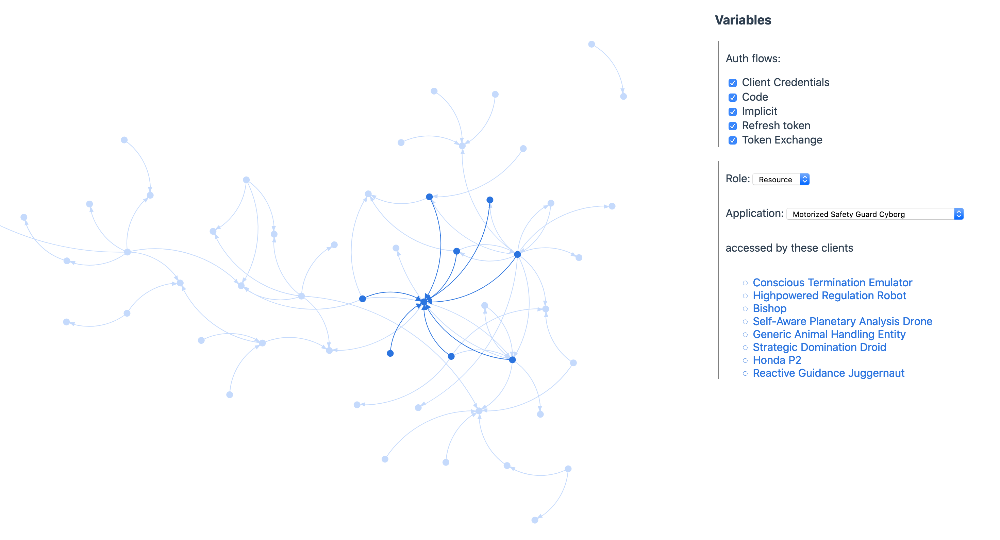

# Visualise authenitcation flows between applications

### Run it
    
    python3 -m http.server 8000

### About the data

This is a dataviz to help you understand the relationships between services that use a single Identity Provider (IDP).

I work in a company where many services interact by passing tokens to one another. Those tokens come from an internal Identity Provider, which has implemented the Oauth2/OIDC specs. 

Your IDP server should (I hope) have audit logs for each transaction when a client calls the server to get a token for a client. For each log, we care about: `client_id`, `resource_id`, `grant_type`

You may notice the data in this [example](output.csv) contains names for robots. This is because I don't own my company's logs. This is a random dataset that looks like something an auth server might log.

# Viz inspiration

- For an example about how to highlight neighbour nodes, I found [Robin Weser's article](https://medium.com/ninjaconcept/interactive-dynamic-force-directed-graphs-with-d3-da720c6d7811) to be useful
- For more about curved lines that have arrows at the ends, [see this block](https://bl.ocks.org/d3noob/5141278)
- Example of drag behaviour, [see this block](http://bl.ocks.org/norrs/2883411)

# Licence

The MIT Licence applies

